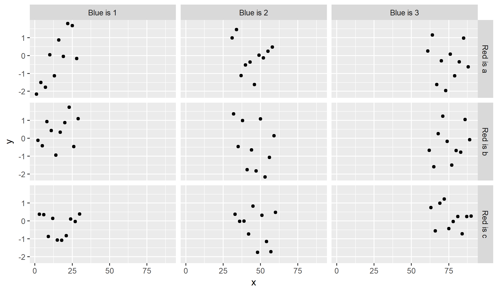
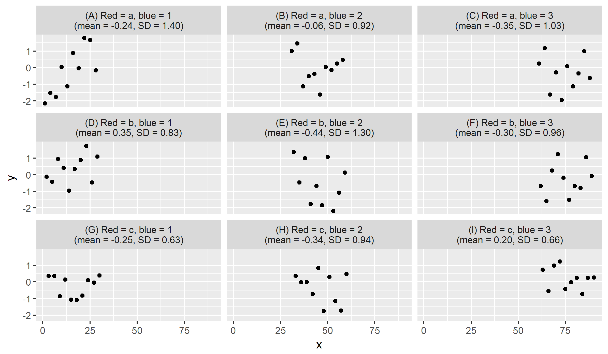

# stickylabeller

The `stickylabeller` package helps you label the facets in your ggplot2 plots. If you know how to use the [`glue`](https://cran.r-project.org/web/packages/glue/index.html) package, you know how to use `stickylabeller`!

## Installation

Install `stickylabeller` from GitHub using `devtools`:

```r
devtools::install_github("rensa/stickylabeller")
```

## Use

The package has just one function: `label_glue`. Give it a string template to be processed by `glue`, and it'll return a labelling function that you can pass to `facet_*`:

```r
library(stickylabeller)

# here's some example data
mydf = data_frame(
  x = 1:90,
  y = rnorm(90),
  red = rep(letters[1:3], 30),
  blue = c(rep(1, 30), rep(2, 30), rep(3, 30)))

# and here's a plot!
ggplot(mydf) +
  geom_point(aes(x = x, y = y)) +
  facet_wrap(
    ~ red + blue,
    labeller = label_glue('Red is {red}\nand blue is {blue}'))
```


```r
ggplot(mydf) +
  geom_point(aes(x = x, y = y)) +
  facet_grid(
    red ~ blue,
    labeller = label_glue(
      rows = 'Red is {red}',
      cols = 'Blue is {blue}'))
```



Your `label_glue` labeller can refer to any of the data frame columns included in the facetting formula. It can also use those columns in expressions, like:

```r
label_glue('Red is {toupper(red)}\nand blue is {blue}')
```

### Numbering sequential facets

As well as the columns you include in the facetting specification, `stickylabeller` includes a few helper columns:

- `.n` numbers the facets numerically: `"1"`, `"2"`, `"3"`...
- `.l` numbers the facets using lowercase letters: `"a"`, `"b"`, `"c"`...
- `.L` numbers the facets using uppercase letters: `"A"`, `"B"`, `"C"`...

So you can automatically number your facets like:

```r
ggplot(mydf) +
  geom_point(aes(x = x, y = y)) +
  facet_wrap(
    ~ red + blue,
    labeller = label_glue('({.l}) Red is {toupper(red)}\nand blue is {blue}'))
```


#### Limitations

* `.l` and `.L` only currently support up to 26 facets—I haven't yet implemented a way for them to continue with AA, AB, AC, etc.
* `.n`, `.l` and `.L` only work with `facet_wrap` for now. See [Issue #1](https://github.com/rensa/stickylabeller/issues/1).

### Including summary statistics in facet labels

There are a couple of ways to include summary statistics using `stickylabeller`. The most flexible way (but probably not the most performant, if you're working with a _massive_ dataset) is to summarise your data and join it back to the original data, so that the summary statistics appear as new columns in the original data. Then include the summary columns in your facetting specification:

```r
library(dplyr)

# summarise the data
multi_summary = mydf %>%
  group_by(red, blue) %>%
  summarise(
    mean_y = sprintf('%#.2f', mean(y)),
    sd_y = sprintf('%#.2f', sd(y))) %>%
  ungroup()

# join it back to the original data
mydf = mydf %>%
  inner_join(multi_summary)

# plot! remember to include the summaries in your facetting spec
ggplot(mydf) +
  geom_point(aes(x = x, y = y)) +
  facet_wrap(
    ~ red + blue + mean_y + sd_y,
    labeller = label_glue(
      '({.L}) Red = {red}, blue = {blue}\n(mean = {mean_y}, SD = {sd_y})'))

```



This works even if you're facetting by multiple columns and summarising by multiple columns. Keep in mind, however, that if you're going to continue to work with the data after plotting, you might want to drop the summary columns in order to avoid confusing yourself.

An alternate way to accomplish this is to convert each of your summary statistics into a vector named for the values of your facet column. This gets really messy with more than one facet column, though!

Have fun! If you hit any snags, please feel free to [file an issue here](https://github.com/rensa/stickylabeller/issues) so that I can get on it! <3
